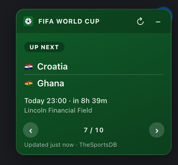

# ChromePluginsWC2026

[](https://github.com/jj-jakub/ChromePluginsWC2026/actions/workflows/ci.yml)

A small monorepo of focused **Chrome extensions (Manifest V3)**. Each plugin lives in its own
folder under [`plugins/`](plugins/) and loads independently — no build step, no dependencies.

<p align="center">
  
</p>

## Plugins

| Plugin | What it does |
| ------ | ------------ |
| **[World Cup Overlay](plugins/worldcup-overlay/)** | A live FIFA World Cup 2026 widget in a **configurable corner of every page** — the in-progress match, or the next fixture / last result. Country flags, ‹ › to rotate the deck, **★ follow nations**, a **group table** and **recent form**, a **today's-fixtures** list, **add-to-calendar**, **drag-to-reposition**, **light/dark theme**, a **toolbar badge + popup**, opt-in **desktop notifications**, **keyboard control**, **5-language** UI, and a **per-site allow/deny** list. Data from [TheSportsDB](https://www.thesportsdb.com/) (free, no signup). [Privacy](plugins/worldcup-overlay/PRIVACY.md). |

## Quick start (just use it)

1. **Get the code**

   ```bash
   git clone https://github.com/jj-jakub/ChromePluginsWC2026.git
   ```

2. **Load the plugin in Chrome**
   - Open `chrome://extensions`
   - Turn on **Developer mode** (top-right)
   - Click **Load unpacked** and select the plugin folder, e.g.
     `ChromePluginsWC2026/plugins/worldcup-overlay`

3. Open any normal webpage — the widget appears in the **top-right corner**.
   (It won't show on `chrome://` pages, which extensions can't touch.)

> After pulling new changes, return to `chrome://extensions` and click the **↻ reload** icon
> on the plugin's card.

## Develop & contribute

No toolchain to install — these are plain HTML/CSS/JS extensions. The workflow is just
**edit → reload → check**:

1. Clone the repo and load the plugin unpacked (steps above).
2. Edit files under the plugin's `src/`.
3. Hit **↻ reload** on `chrome://extensions`, then refresh a page to see your change.
4. Sanity-check before committing:

   ```bash
   # run the unit tests for the pure logic (zero dependencies)
   cd plugins/worldcup-overlay && node --test

   # validate the manifest (mv3, semver, referenced files exist, WAR well-formed)
   node scripts/validate-manifest.mjs plugins/worldcup-overlay
   ```

   Both run automatically on every push/PR via [GitHub Actions](.github/workflows/ci.yml).

### Repository layout

```
plugins/
  _template/          copy this to start a new plugin
  worldcup-overlay/   the World Cup top-right overlay
docs/                 contributing notes, how-to, images
scripts/              helpers (e.g. package a plugin into a .zip)
dist/                 build output (git-ignored)
```

### Add a new plugin

```bash
cp -r plugins/_template plugins/my-new-plugin
```

Then edit its `manifest.json` (name, description, least-privilege permissions) and fill in
`src/`. Full guide: [docs/adding-a-plugin.md](docs/adding-a-plugin.md) ·
conventions: [docs/CONTRIBUTING.md](docs/CONTRIBUTING.md).

### Package for distribution

```bash
scripts/package.sh worldcup-overlay     # -> dist/worldcup-overlay.zip
```

The zip has `manifest.json` at its root — ready for the Chrome Web Store or manual install.

## Conventions

- **One plugin per folder, independently loadable** — no cross-plugin imports.
- **Least privilege** — request the narrowest `permissions` / `host_permissions` that work.
- **Vanilla first** — avoid frameworks and build steps unless a plugin truly needs one.
- **Isolate injected UI** — namespace ids/classes, reset inherited styles, use a sane `z-index`.

## License

[MIT](LICENSE) © 2026 Jakub Jasinski
